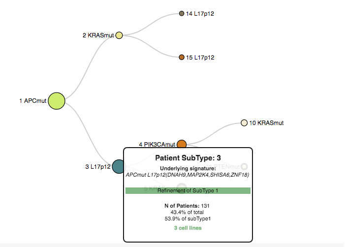
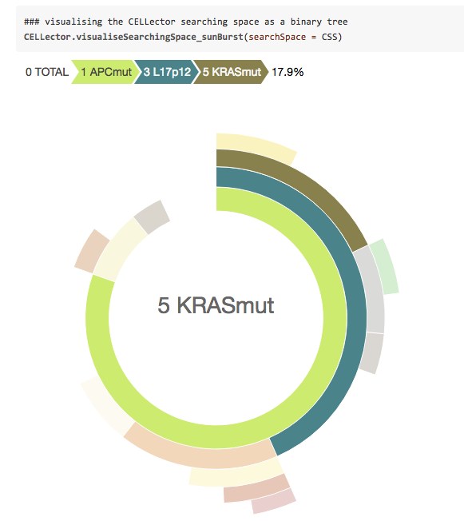

# CELLector: Genomics Guided Selection of Cancer in vitro models

Najgebauer, H., Yang, M., Francies, H., Pacini, C., Stronach, E. A., Garnett, M. J., Saez-Rodriguez, J., & Iorio, F. (n.d.). CELLector: Genomics Guided Selection of Cancer in vitro Models. http://doi.org/10.1101/275032

2018-04-14
CELLector is a computational tool assisting experimental scientist in the selection of the most clinically relevant cancer cell lines to be included in a new in-vitro study (or to be considered in a retrospective study), in a patient-genomic guided fashion.

CELLector combines methods from graph theory and market basket analysis; it leverages tumour genomics data to explore, rank, and select optimal cell line models in a user-friendly way, through the [CELLector Rshiny App](https://github.com/francescojm/CELLector_app). This enables making appropriate and informed choices about model inclusion/exclusion in retrospective analyses, future studies and it makes possible bridging cancer patient genomics with public available databases froom cell line based functional/pharmacogenomic screens, such as [CRISPR-cas9 dependency datasets](https://score.depmap.sanger.ac.uk/) and [large-scale in-vitro drug screens](https://www.cancerrxgene.org/).

Furthermore, CELLector includes interface functions to synchronise built-in cell line annotations and genomics data to their latest versions from the [Cell Model Passports](https://cellmodelpassports.sanger.ac.uk/) resource. Through this interface, bioinformaticians can quickly generate binary genomic event matrices (BEMs) accounting for hundreds of cancer cell lines, which can be used in systematic statistical inferences, associating patient-defined cell line subgroups with drug-response/gene-essentiality, for example through [GDSC tools](https://gdsctools.readthedocs.io/en/master/).

Additionally, CELLector allows the selection of models within user-defined contexts, for example, by focusing on genomic alterations occurring in biological pathways of interest or considering only predetermined sub-cohorts of cancer patients. 

Finally, CELLector identifies combinations of molecular alterations underlying disease subtypes currently lacking representative cell lines, providing guidance for the future development of new cancer models.

License: MIT

## Running Modalities

CELLector can be used in three different modalities:
  - (i) as an R package (within R, code available at: https://github.com/francescojm/CELLector)
  
  - (ii) as an online R shiny App (available at: https://ot-cellector.shinyapps.io/CELLector_App/)**,
  
  - (iii) running the R shiny App locally (within Rstudio, code available at: https://github.com/francescojm/CELLector_App).

A tutorial on how to use the online Rshiny app (containing also instruction on how to run it locally) is available here: https://www.biorxiv.org/highwire/filestream/92891/field_highwire_adjunct_files/0/275032-1.pdf

  ** This has been temporarily deployed on a public Rshiny Server, which comes with a monthly time usage limitation. Deployment on a corporative server is in progress. If time limit has been reached, thus the online version of the App is down, please refer to the (iii) modality. 

## R package: quick start (interactive vignette)

http://rpubs.com/francescojm/CELLector

